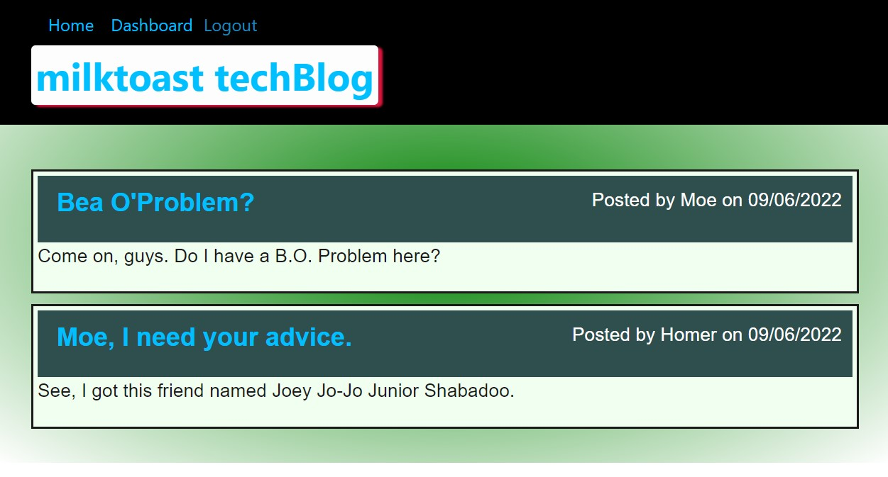
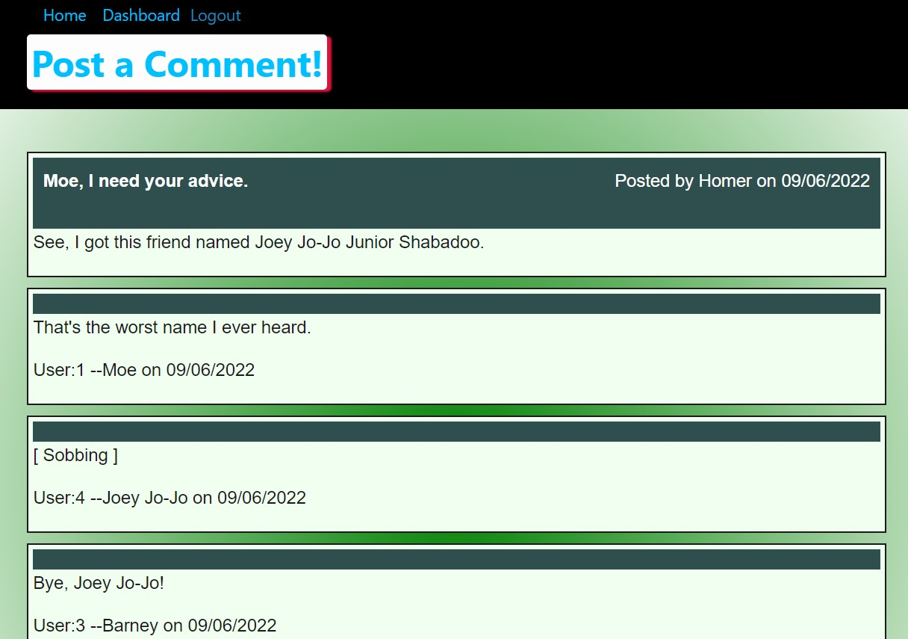

# milktoast-techBlog

  # Description
  
  A simple blog that uses the express framework to allow users to signup an account and make posts and comments. Uses mysql2 NPM package for database handling of user accounts, posts, comments and sessions/cookies. HTML pages are rendered using Express-handlebars.

  # Table of Contents
  
  - [Installation](#installation)
  - [Usage](#usage)
  - [Tests](#tests)
  - [Questions](#questions)

  # Installation
  
  Node.js, NPM packages: bcrypt, connect-session-sequelize, dotenv, express, express-handlebars, express-session, mysql2, sequelize.

  # Usage
  
  
  

  # Tests
  
  No tests run.

  # Questions
  
  You can find my GitHub profile at: https://github.com/r134x7

  If you have any questions, you can contact me by email: r134x7@gmx.com

